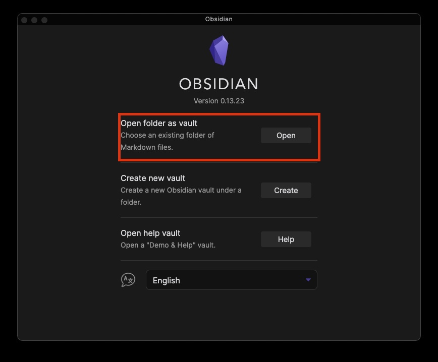

## This Repo contains all the documentation relating to the Quadcopter AR Project I highly advise you to read this page first and then go to the Getting Started folder.

If you are to work on a game, any information that is needed to that game must be stored under
`./Games/<GameName>/...`

If you are a graduating student please also leave any relavent contact information under 
`./People/<Name>.md`. This is to help new people have a way to contact you incase they require understanding of your work.

## Please use markdown as the default file format to handle any documentation. If it is to submit to a group then latex works as well.

A tutorial on Markdown is available [here](https://guides.github.com/features/mastering-markdown/)

## The way we manage markdown notes is through an app called [Obsidian](https://obsidian.md/)
- The app is simple to use and, more importantly, it lets us link between different markdown notes. It basically lets us write markdown easier.
- Make sure you also install the [Obsidian-git](obsidian://show-plugin?id=obsidian-git) Extension as it allows you to sync the files to git. To do this
	- First download obsidian and install it.
	- Second clone this repository onto your local machine.
	- Add the folder to your obsidian vault
		
		- Once the folder is added, go into the settings panel of Obsidian and enable community plugins. Here you can search and install [Obsidian-git](obsidian://show-plugin?id=obsidian-git)
		- Now you may have to close and re-open Obsidian, then you can go back into the settings and can access the Obsidian-git settings pane.
			- Make sure these options are set as follows:
				- Set commit message to `updating documentation: {{date}}`
				- Set Sync Method to `rebase`
				- Turn on `List filenames affected by commit in commit body`
			- Now you should restart obsidian again and should be good to go!

# Now, lets go to [[Introduction]]
